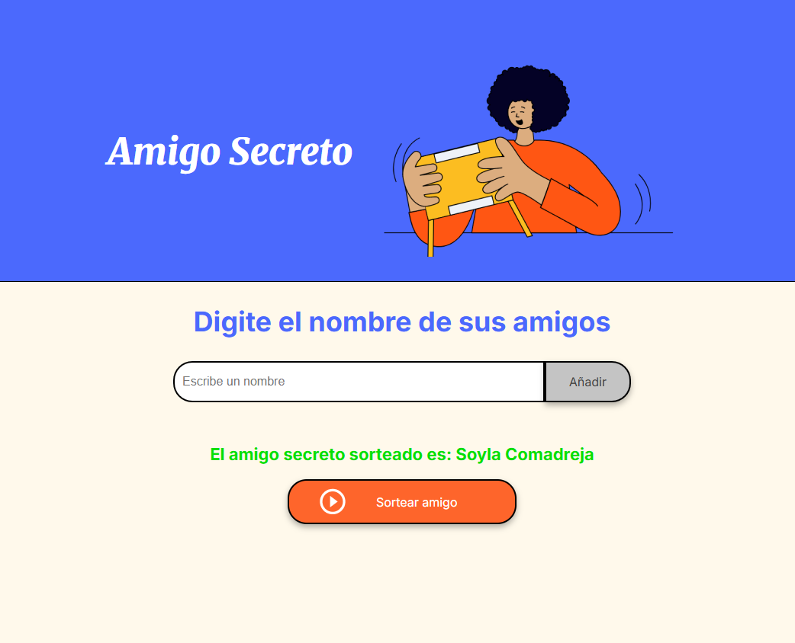

# 🎁 Amigo Secreto

Un mini proyecto en HTML, CSS y JavaScript para sortear un **amigo secreto** entre una lista de nombres que el usuario ingresa manualmente.

---

## 📸 Vista previa



---

## 🚀 Tecnologías

- HTML5
- CSS3
- JavaScript Vanilla

---

## ✅ Funcionalidades

- ✅ Agregar nombres a una lista
- ✅ Mostrar los nombres ingresados en pantalla
- ✅ Sortear un nombre al azar
- ⚠️ Validación de campos vacíos

---

## 🧠 Lógica general

1. El usuario ingresa nombres de amigos.
2. Se van agregando a un array y se muestra la lista.
3. Al hacer clic en **Sortear**, se elige uno al azar usando `Math.random()`.
4. El nombre sorteado se muestra en pantalla.

---

## 📂 Estructura del proyecto

```
amigo-secreto/
│
├── index.html         # Estructura principal
├── style.css          # Estilos básicos
├── app.js             # Lógica JS (manejo de DOM + sorteo)
└── assets/
    └── amigo-secreto.png  # Imagenes
```

---

## 🛠 Cómo usar

1. Clona el repo:

```bash
git clone https://github.com/andresgd7/challenge-amigo-secreto_esp-main.git
```

2. Abre el archivo `index.html` en tu navegador.

No requiere servidor, dependencias ni compilación.


## 👨‍💻 Autor

Desarrollado por [andresgd7](https://github.com/andresgd7).
